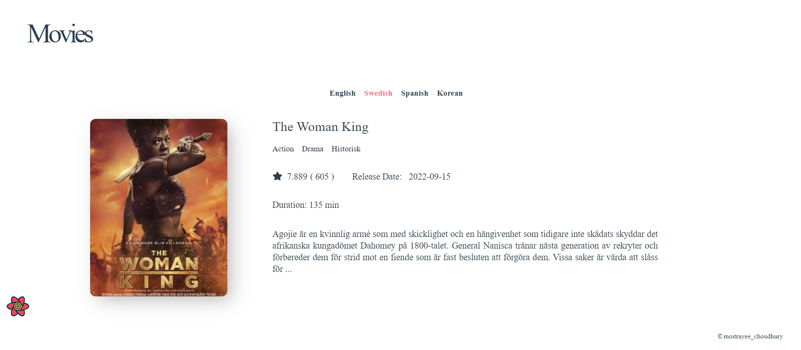

# Movies

A responsive movie site using TMDB Api and React.js . The target was to build a webapplication where real Movie data can be displayed.

## Libraries and Technologies

- The Movie Database (TMDb) API
- Uses React, including React Hooks
- Uses axios for data fetching
- Uses React Router Dom for routing
- Uses React Query for caching API responses
- Styled with Styled Components
- Uses FontAwesome for React

To run the project in development mode, you need your own API Key.
Get API key from - <https://www.themoviedb.org/>

You need to create .env and add REACT_APP_API_KEY=your-api

## Screenshots

