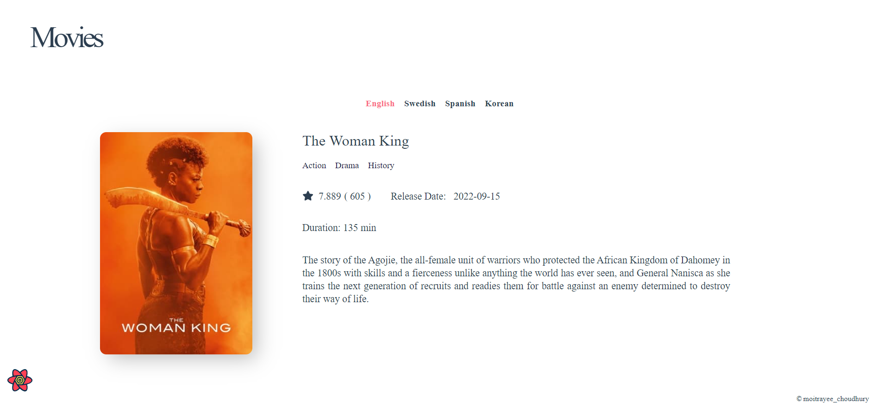
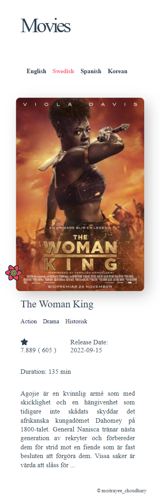

# Movies

A responsive movie site using TMDB API and React.js . The target was to build
a web application where Movie data can be displayed.

## Libraries and Technologies

- The Movie Database (TMDb) API
- React, including React Hooks
- axios for data fetching
- React Router Dom for routing
- React Query for caching API responses
- Styled with Styled Components
- FontAwesome for React

## Features

- Scalable
- Pagination
- Language Translation
- React Routing
- Responsive Design
- Reusable Component

To run the project in development mode, you need your own API Key.
Get API key from - <https://www.themoviedb.org/>

You need to create .env and add REACT_APP_API_KEY=your-api

## Screenshots

### Home Page

### Movie Details Page

### Mobile View

